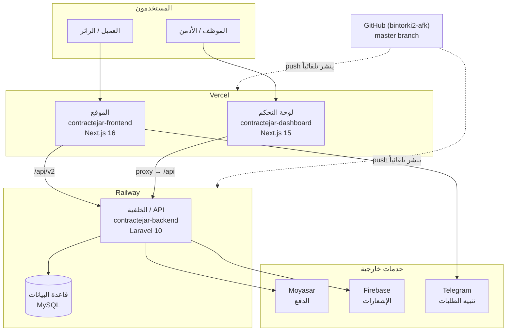
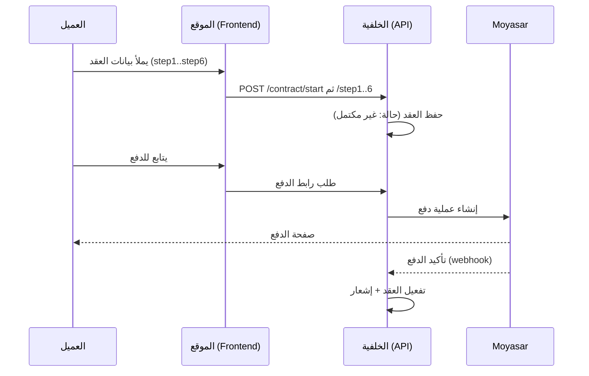

# 🏗️ المخطط المعماري — صقر واحد (contractejar)

> كيف تتكامل مكوّنات المشروع والخدمات الخارجية. آخر تحديث: 2026-10-02

## نظرة عامة

## تدفّق العمل الأساسي (إنشاء عقد)

## ملاحظات
- **النشر تلقائي بالكامل:** `push` إلى `master` ← Vercel/Railway ينشران دون تدخّل.
- **الموقع** يتصل بالـ API مباشرة عبر `/api/v2`؛ **اللوحة** تمرّر عبر proxy داخلي (`API_PROXY_TARGET`).
- **قاعدة البيانات** مصدر الحقيقة لكل البيانات (عقود، عملاء، مالية) — احرص على نسخها الاحتياطي (راجع `OWNER-GUIDE.md`).
